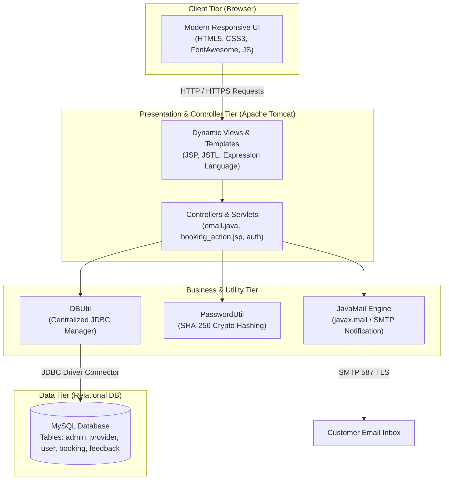
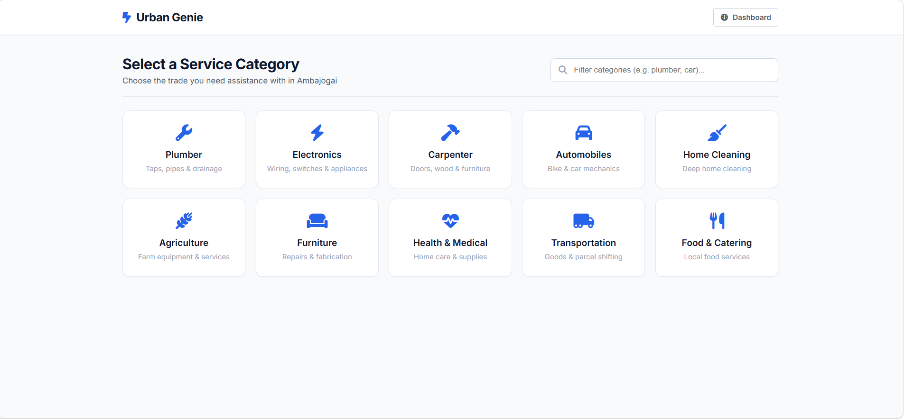
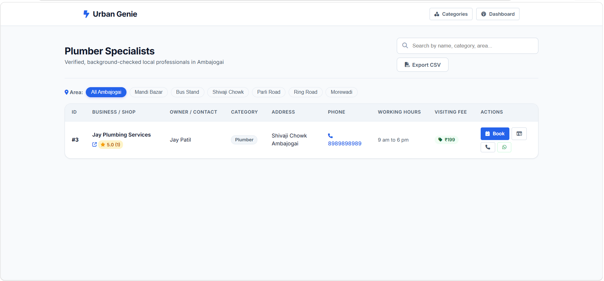
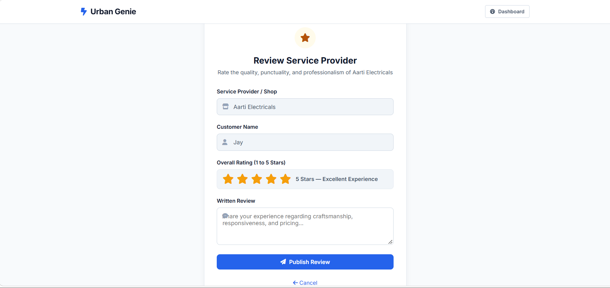
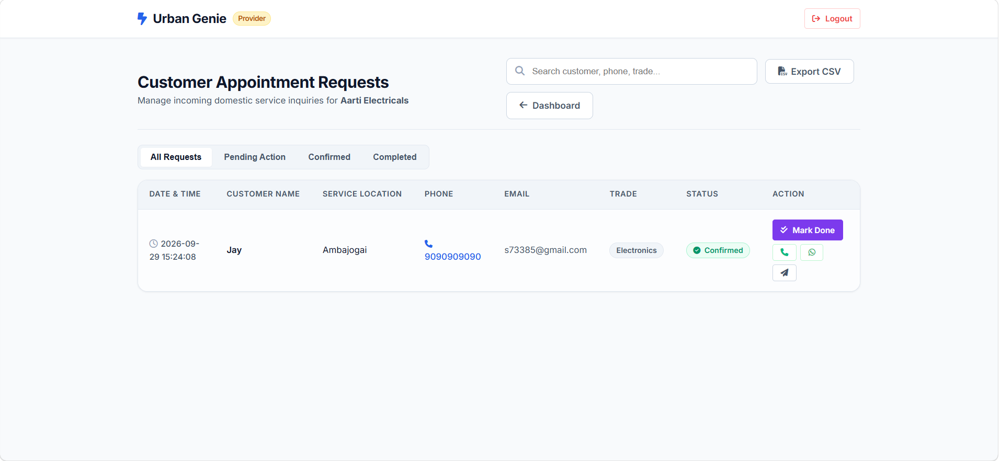
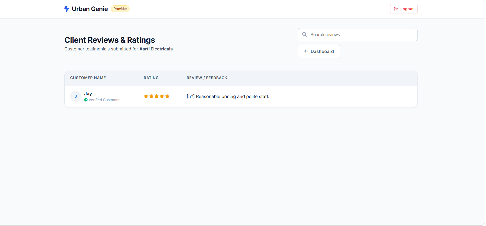
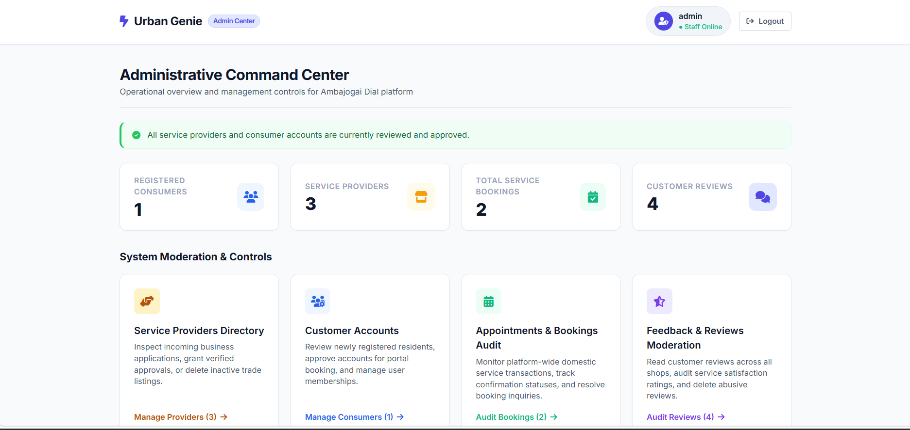
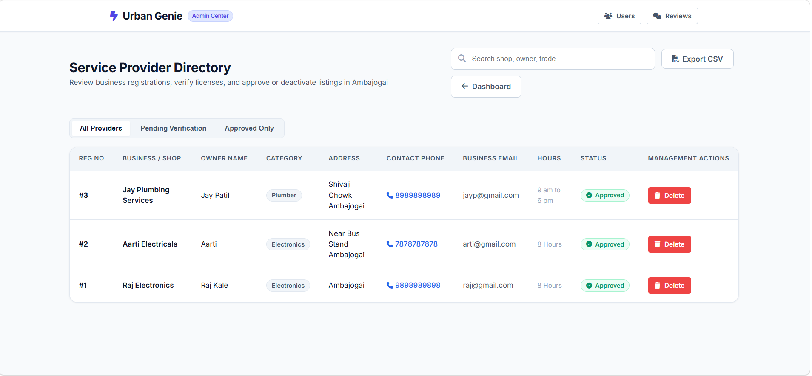
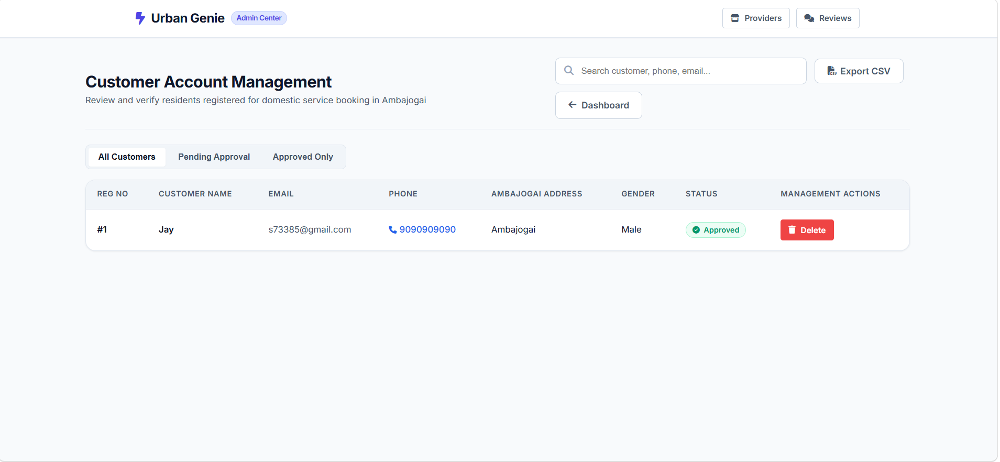
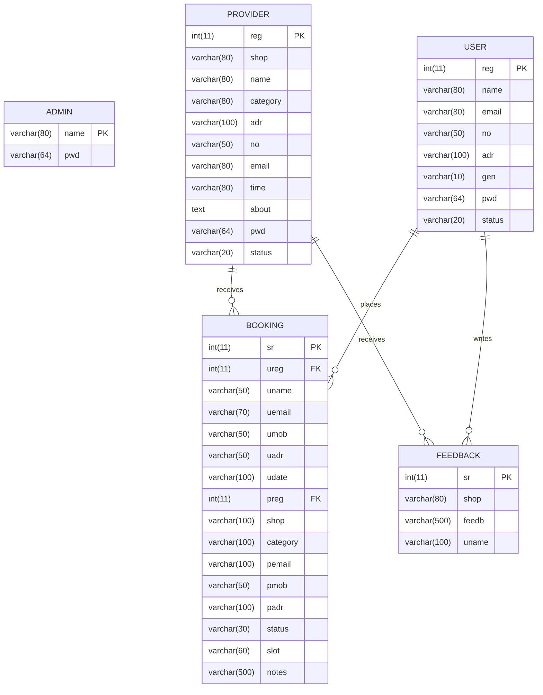

# 🧞‍♂️ UrbanGenie — Public Domestic Services Web Portal

<p align="center">
  
</p>

<p align="center">
  <strong>A hyperlocal, on-demand domestic and public home services discovery, booking, and management platform for Ambajogai city.</strong>
</p>

<p align="center">
  <a href="#-key-features"></a>
  <a href="#-tech-stack"></a>
  <a href="#-tech-stack"></a>
  <a href="#-tech-stack"></a>
  <a href="#-security"></a>
  <a href="#license"></a>
</p>

---

## 📌 Executive Summary

**UrbanGenie** bridges the gap between local residents and verified domestic service professionals (electricians, plumbers, carpenters, appliance technicians, home painters, deep cleaners) in the Ambajogai municipal region. 

Traditional word-of-mouth service procurement is plagued by opaque pricing, unreliable technician availability, and lack of accountability. UrbanGenie delivers a unified, transparent web portal featuring real-time service requests, status tracking, automated customer email notifications, a provider scheduling pipeline, and an administrative oversight dashboard.

---

## 🚀 Key Highlights & Capabilities

- 🔍 **Interactive Service Directory**: Filter providers by specialty (Electronics, Electricals, Plumbing, Painting, Carpentry, Cleaning) with instant search.
- 📅 **Streamlined Booking Pipeline**: Select preferred dates, specify morning/afternoon/evening slots, and provide specialized task instructions.
- 📧 **Automated Email Notifications**: Seamless integration with JavaMail API (SMTP) sends real-time confirmation emails directly to users when bookings are acknowledged.
- 🛡️ **End-to-End Enterprise Security**: 
  - SHA-256 cryptographic password hashing (`PasswordUtil`).
  - Parameterized SQL PreparedStatements across all operations to prevent SQL Injection vulnerabilities.
  - Role-Based Access Control (RBAC) separating Customers, Service Providers, and Administrators.
- 📊 **Executive Admin Command Center**: Comprehensive KPIs, provider verification & approval workflows, user auditing, master booking ledger, and review moderation.
- ⭐ **Transparent Review System**: Verified customer feedback loop with star ratings and authentic testimonials.
- 🎨 **Modern Responsive UI**: Clean aesthetics, glassmorphism accents, mobile-friendly layouts, micro-animations, and intuitive form validation.

---

## 🏛️ System Architecture & Workflow

UrbanGenie follows a standard **Java Enterprise Edition (J2EE) Multi-Tier Web Architecture**:



---

## 👥 Role-Based Feature Modules

### 1. 👤 Customer / Resident Portal
- **Self-Service Registration & Auth**: Secure account setup with address and phone number binding.
- **Service Catalog Exploration**: Browse technicians by trade with verified badges, operational hours, and customer ratings.
- **Booking Engine**: Submit home service requests with specific date, slot preference, and service notes.
- **My Bookings Dashboard**: Real-time tracking of request statuses (`Pending` ⏳, `Accepted` ✅, `Completed` 🏆, `Cancelled` ❌).
- **Feedback & Rating**: Submit authentic 1–5 star reviews and performance comments.

### 2. 🧰 Service Provider Portal
- **Business Profile Management**: Register workshop/store details, operating hours, service radius, and bio.
- **Inbound Request Pipeline**: Review incoming service appointments, customer contact details, and location.
- **Booking Fulfillment Workflow**: Accept or decline requests with automatic trigger of customer confirmation email.
- **Customer Reviews Feed**: Real-time visibility into customer satisfaction scores and feedback.

### 3. 🛡️ Super Administrator Command Center
- **Executive Analytics**: Key metric counters for total registered users, verified providers, active bookings, and customer reviews.
- **Provider Verification & Directory**: Review newly registered shops, toggle approval states (`approved` / `pending`), or purge inactive listings.
- **User Directory**: Full governance over resident accounts and profiles.
- **Master Booking Oversight**: Global audit trail of all domestic service transactions across Ambajogai.
- **Feedback Moderation**: Remove spam or inappropriate reviews to preserve directory integrity.

---

## 📸 Visual Showcase & Screenshots

### 🌐 Public & Customer Experience

| Landing & Discovery | Service Catalog |
| :---: | :---: |
|  |  |
| *Hero banner with search and metrics* | *Service category discovery grid* |

| Provider Search & Listing | Shop Profile & Booking Modal |
| :---: | :---: |
|  |  |
| *Verified local technicians in Ambajogai* | *Detailed business information & instant booking* |

| Customer Dashboard | Ratings & Feedback Modal |
| :---: | :---: |
|  |  |
| *Personal bookings and active service orders* | *5-star satisfaction review submission* |

---

### 🧰 Service Provider Operations

| Provider Dashboard | Inbound Service Bookings |
| :---: | :---: |
|  |  |
| *Provider overview and operational summary* | *Booking pipeline with accept/status update actions* |

<p align="center">
  <strong>Provider Customer Reviews & Reputation Feed</strong><br>
  
</p>

---

### 🛡️ Administrative Command Center

| Executive Dashboard | Provider Directory Moderation |
| :---: | :---: |
|  |  |
| *KPI counters and platform summary* | *Approve, verify, or remove service providers* |

| Customer Directory Governance | Central Booking Master Audit |
| :---: | :---: |
|  |  |
| *Resident account administration* | *System-wide booking log with live status filtering* |

<p align="center">
  <strong>Feedback Moderation & Quality Control</strong><br>
  
</p>

---

## 🛠️ Tech Stack & Dependencies

| Layer | Technologies & Tools |
| :--- | :--- |
| **Backend** | Java EE (JDK 8+), Java Servlets, JSP (JavaServer Pages), JSTL, JDBC |
| **Database** | MySQL 5.7 / 8.0, InnoDB engine, UTF-8 Multilingual collation |
| **Frontend** | Semantic HTML5, Vanilla CSS3 (custom CSS variable system, flexbox/grid), Vanilla JavaScript |
| **UI Icons & Fonts** | FontAwesome 6, Google Fonts |
| **Mail & Messaging** | JavaMail API (`javax.mail.jar`), JavaBeans Activation Framework (`activation.jar`), SMTP Protocol |
| **Database Driver** | MySQL Connector/J (`mysql-connector-java-5.1.23-bin.jar`) |
| **Web Server / Servlet Container** | Apache Tomcat 8.5 / 9.0 / 10 |
| **Build System** | Apache Ant (`build.xml`), NetBeans IDE project configuration |

---

## 🗄️ Database Schema & Data Dictionary

The application relies on 5 core relational tables defined in [`dial.sql`](dial.sql):



---

## ⚙️ Installation & Local Setup

### 1. Prerequisites
- **Java Development Kit (JDK)**: Version 8 or higher (`java -version`, `javac -version`)
- **Apache Tomcat**: Version 8.5, 9.0, or 10.x
- **MySQL Server**: Version 5.7+ or 8.0+
- **IDE (Optional)**: Apache NetBeans, Eclipse for Enterprise Java, or VS Code with Java Extension Pack

---

### 2. Database Initialization
1. Start your local MySQL service.
2. Open your terminal or MySQL Workbench / phpMyAdmin:
```bash
mysql -u root -p
```
3. Import the provided schema and sample seed records:
```sql
SOURCE path/to/UrbanGenie/dial.sql;
```
*(This automatically creates the `dial` database with tables and sample providers.)*

---

### 3. Database & Mail Configuration
The application uses [`DBUtil.java`](src/java/DBUtil.java) with automatic environment variable and system property fallbacks:

```properties
# Default connection parameters
DB_URL  = jdbc:mysql://localhost:3306/dial?useSSL=false&allowPublicKeyRetrieval=true
DB_USER = root
DB_PASS = root
```

To configure automated email dispatch via Gmail SMTP, specify credentials in [`web/WEB-INF/web.xml`](web/WEB-INF/web.xml) or via environment variables:
```bash
export MAIL_USERNAME="your-email@gmail.com"
export MAIL_PASSWORD="your-google-app-password"
```

---

### 4. Running the Application

#### Option A: Deploy Pre-built WAR (Fastest)
1. Copy [`dist/Public_Domestic_Services_Website.war`](dist/Public_Domestic_Services_Website.war) to your Tomcat directory:
   ```bash
   cp dist/Public_Domestic_Services_Website.war $CATALINA_HOME/webapps/UrbanGenie.war
   ```
2. Start Tomcat (`bin/startup.sh` or `bin/startup.bat`).
3. Open your browser at:
   ```
   http://localhost:8080/UrbanGenie/
   ```

#### Option B: Open in NetBeans IDE
1. Open **NetBeans IDE** -> `File` -> `Open Project`.
2. Browse to and select `Public_Domestic_Services_WebPortal`.
3. Right-click the project -> **Resolve Data Sources / Libraries** (ensure Tomcat is configured in Services).
4. Click **Clean and Build**, then click **Run Project** (`F6`).

---

## 🔑 Default Seed Credentials

For quick evaluation, pre-seeded accounts are provided in `dial.sql`:

| Role | Username / Identifier | Password | Access URL |
| :--- | :--- | :--- | :--- |
| **Administrator** | `admin` | `12345` | `/admin.jsp` |
| **Electronics Provider** | `raj@gmail.com` | `123` | `/provider.jsp` |
| **Plumbing Specialist** | `jayp@gmail.com` | `123` | `/provider.jsp` |
| **Electrical Specialist**| `arti@gmail.com` | `123` | `/provider.jsp` |
| **Painting Specialist**  | `ganesh@painters.com` | `123` | `/provider.jsp` |
| **Customer / User** | `s73385@gmail.com` | `123` | `/user.jsp` |

---

## 📂 Project Directory Structure

```plaintext
UrbanGenie/
├── Screenshots/                   # UI & operational dashboard screenshots
│   ├── Landing Page.png
│   ├── Services.png
│   ├── List.png
│   ├── Shop Profile.png
│   ├── Feedback.png
│   ├── User Home.png
│   ├── Provider home.png
│   ├── Provider_Bookings.png
│   ├── Provider_feedbacks.png
│   ├── Admin_Home.png
│   ├── Admin_directory.png
│   ├── Admin_customerDirectory.png
│   ├── admin Bookings Directory.png
│   └── Admin Feedback Directory.png
├── dist/                          # Production distribution archives
│   └── Public_Domestic_Services_Website.war
├── lib/                           # Core drivers and dependencies
│   ├── MySQLDriver/
│   │   └── mysql-connector-java-5.1.23-bin.jar
│   ├── CopyLibs/
│   └── javaee-endorsed-api-7.0/
├── nbproject/                     # NetBeans project configuration
│   ├── project.properties
│   ├── project.xml
│   └── build-impl.xml
├── src/java/                      # Java Backend source code
│   ├── DBUtil.java                # Centralized JDBC connection manager
│   ├── PasswordUtil.java          # SHA-256 password hashing utility
│   ├── email.java                 # SMTP email notification servlet
│   └── util/                      # Package utility classes
├── web/                           # Web application root
│   ├── WEB-INF/
│   │   └── web.xml                # Deployment descriptor & servlet mappings
│   ├── css/
│   │   └── style.css              # Main responsive styling
│   ├── js/
│   │   └── main.js               # Frontend validation & interactive UI logic
│   ├── index.html                 # Main landing portal page
│   ├── admin*.jsp                 # Administrative portal views
│   ├── provider*.jsp              # Provider portal views
│   ├── user*.jsp                  # Customer portal views
│   └── bookservice.jsp            # Service appointment booking engine
├── dial.sql                       # Database schema and seed data
├── activation.jar                 # JavaBeans Activation Framework
├── javax.mail.jar                 # JavaMail API library
├── build.xml                      # Apache Ant build script
└── README.md                      # Comprehensive project documentation
```

---

## 🔒 Security Best Practices Implemented

- **Password Cryptography**: Passwords are never stored in plaintext. They are encrypted using 256-bit SHA-256 hashes.
- **SQL Injection Prevention**: Database operations utilize parameterized queries (`PreparedStatement`) instead of direct string concatenation.
- **Session Validation**: Sensitive administration and provider endpoints validate active session tokens on each page request.
- **Input Sanitization**: Basic HTML input validation and sanitization prevent malicious script injections in review notes.

---

## 🤝 Contributing

Contributions, issues, and feature requests are welcome!
1. Fork the Project.
2. Create your Feature Branch (`git checkout -b feature/AmazingFeature`).
3. Commit your Changes (`git commit -m 'Add some AmazingFeature'`).
4. Push to the Branch (`git push origin feature/AmazingFeature`).
5. Open a Pull Request.

---

## 📄 License

This project is licensed under the [MIT License](LICENSE).

---

<p align="center">
  Made with ❤️ by <a href="https://github.com/OmkarP1919"><strong>Omkar Potangale</strong></a>
</p>
